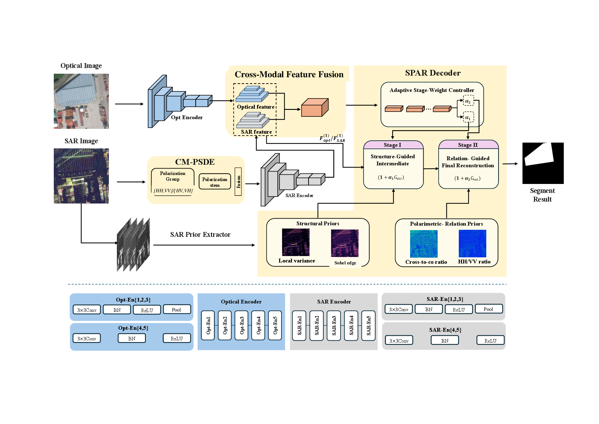
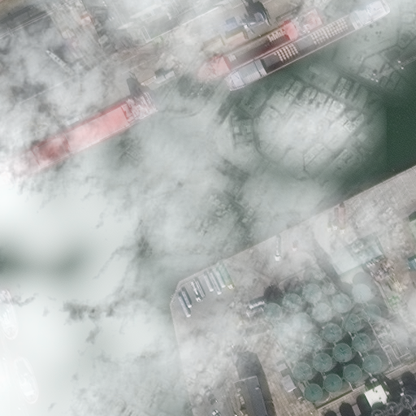
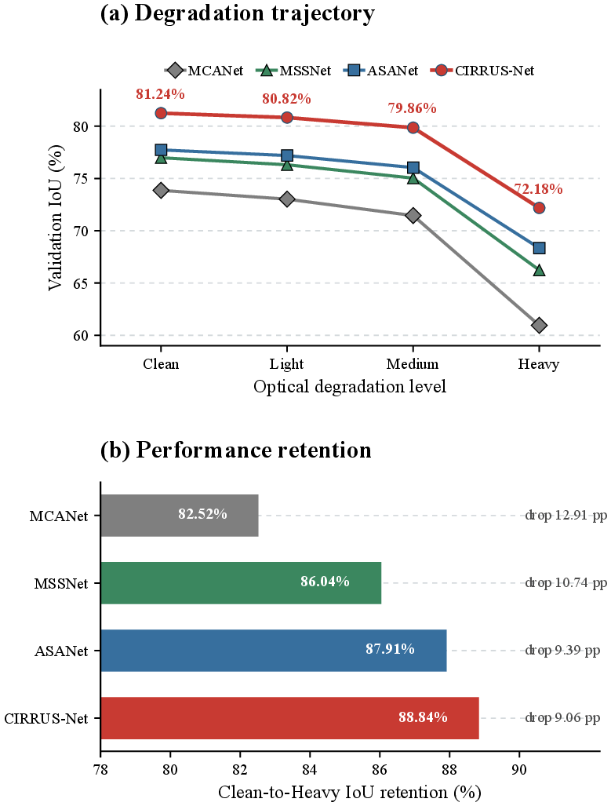
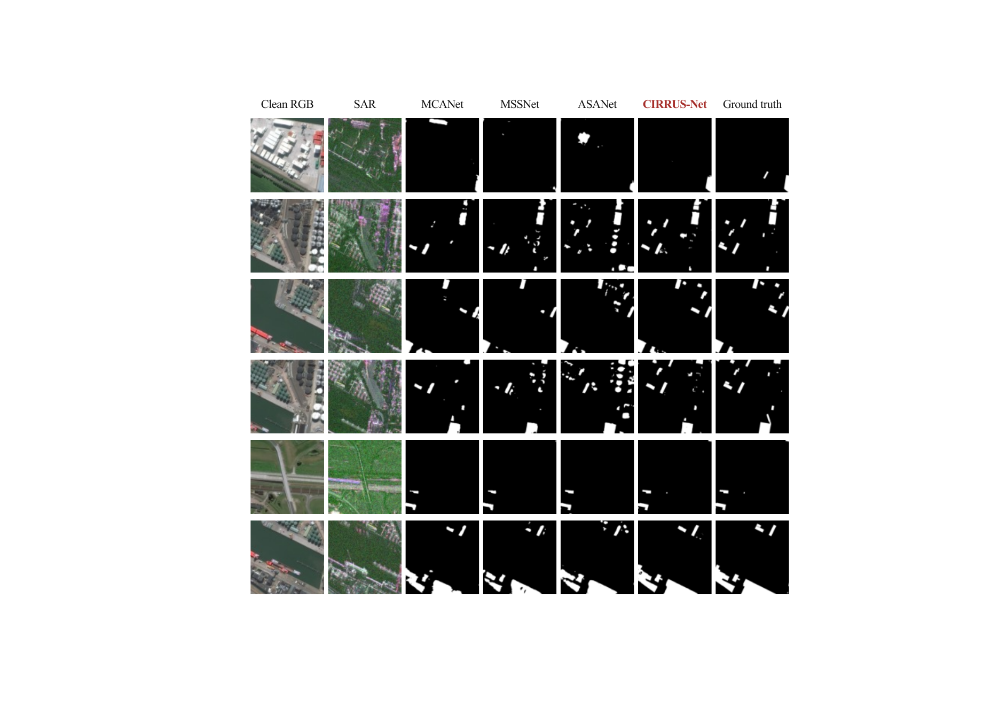
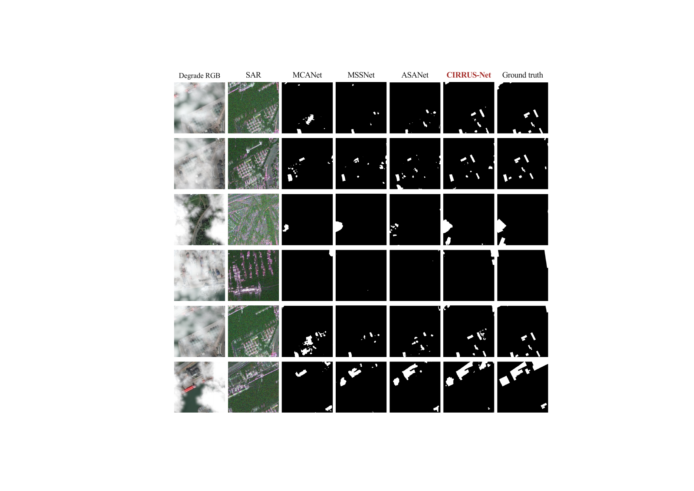

# CIRRUS-Net

**Knowledge-Guided and Reliability-Adaptive Multi-Polarization SAR-Optical Building Segmentation under Optical Degradation**

> Preview release. This repository currently provides the paper abstract, data provenance, a limited degradation sample, the method overview, and selected quantitative and qualitative results. Training code and model weights are not included in this release.

## Method Overview

[PDF version](assets/method/cirrus_net_overall.pdf)

## Abstract

Building semantic segmentation from SAR and optical imagery benefits from their complementary texture and scattering information. However, cloud and fog degradation can substantially reduce the reliability of optical observations and weaken multimodal fusion. Existing SAR-optical methods often use single-channel SAR data or directly stack HH, HV, VH, and VV channels as ordinary input bands, overlooking the polarization-dependent differences and complementarity between co- and cross-polarized scattering responses. Moreover, SAR information is usually exploited mainly during feature fusion, while its structural cues remain underused during decoder-side reconstruction.

To address these limitations, we propose CIRRUS-Net, a multi-polarization SAR-optical building segmentation framework that integrates complementary scattering modeling, identity-preserving reliability adaptation, and prior-guided reconstruction under cloud-fog degradation. A Complementarity-Modeling Polarimetric Scattering Decoupling Encoder (CM-PSDE) explicitly separates co- and cross-polarized responses and learns their complementary representations. Structural and polarization-relation priors are then constructed from the four-channel SAR input and incorporated into a Structural-Polarimetric Adaptive Reconstruction Decoder (SPAR-Decoder), where they guide intermediate-scale detail recovery and high-resolution building-mask reconstruction, respectively. An Identity-Preserving Reliability-Adaptive Fusion module (IP-RAF) further preserves Cross-Modal Semantic-Selective Gating (CMSG) as its base fusion pathway while introducing alpha-map-supervised reliability estimation to adaptively regulate cross-modal residual correction when optical observations are degraded.

Experiments are conducted on the SpaceNet 6 Expanded Dataset under clean conditions and multiple cloud-fog degradation levels. The degraded samples are synthesized using cloud observations and masks from HRC_WHU, and representation transfer is further examined on cross-region Sentinel-1/2 data. CIRRUS-Net achieves an IoU of **83.50%** under clean observations. Under matched mixed-degradation training, it obtains **72.18% IoU** under heavy degradation, improving over the strongest comparison method by **3.84 percentage points** and retaining **88.84%** of its clean-condition IoU. A dual-polarization adaptation achieves **76.52% IoU** on the cross-region Sentinel-1/2 data. Ablation studies further indicate that complementary polarization modeling and stage-matched prior reconstruction improve building representation, while the benefit of reliability-controlled residual correction becomes more evident as optical degradation increases.

The currently released code and preview data for this study are available at the [CIRRUS-Net GitHub repository](https://github.com/MLS2021/CIRRUS-Net).

## Degradation Preview

The following images show the same SpaceNet 6 patch under clean, light, medium, and heavy optical degradation. SAR observations and building labels remain unchanged during degradation generation.

| Clean | Light | Medium | Heavy |
|:---:|:---:|:---:|:---:|
|  |  |  |  |

The sample metadata and usage notice are provided in [`sample_data/degradation_sequence`](sample_data/degradation_sequence/README.md). These preview files are derived from third-party datasets and are not covered by any future source-code license for this repository.

## Preliminary Results

| Training protocol | Clean | Light | Medium | Heavy | Clean-to-Heavy retention |
|---|---:|---:|---:|---:|---:|
| Clean-only training | **83.50** | - | - | - | - |
| Mixed-degradation training | 81.24 | 80.82 | 79.86 | **72.18** | **88.84** |

Values are foreground-building IoU percentages under the fixed spatial split and the stated training protocol. The clean-only and mixed-degradation rows are different experiments and should not be compared as if they were checkpoints from the same run. Additional protocol details and selected comparisons are available in [`docs/RESULTS.md`](docs/RESULTS.md).

### Robustness under increasing cloud-fog degradation

[PDF version](assets/results/cloud_fog_robustness.pdf)

### Qualitative comparison under clean observations

[PDF version](assets/results/spacenet_clean_qualitative.pdf)

### Qualitative comparison under heavy degradation

[PDF version](assets/results/spacenet_degraded_qualitative.pdf)

## Data Sources and Usage Terms

The experiments use SpaceNet 6, Copernicus Sentinel-1/2, ESA WorldCover 2021, and HRC_WHU. Their licenses or provider-specified usage terms are different. This repository does not relicense upstream data and does not redistribute the complete upstream datasets.

See [`docs/DATA_SOURCES.md`](docs/DATA_SOURCES.md) for source links, required attribution, citations, and dataset-specific restrictions. Machine-readable references are provided in [`docs/CITATIONS.bib`](docs/CITATIONS.bib).

The current release and licensing boundary is summarized in [`NOTICE.md`](NOTICE.md). No source-code license is granted before the implementation is released.

## Release Plan

The complete training and inference code, configuration files, model checkpoints, and full degradation dataset are planned for release after manuscript acceptance and completion of the documentation and data-license review.

## Repository Status

- [x] English abstract
- [x] Dataset provenance and usage terms
- [x] Limited clean/light/medium/heavy sample sequence
- [x] Method overview
- [x] Selected quantitative and qualitative results
- [ ] Training and inference code
- [ ] Configuration files
- [ ] Model checkpoints
- [ ] Full degradation dataset
